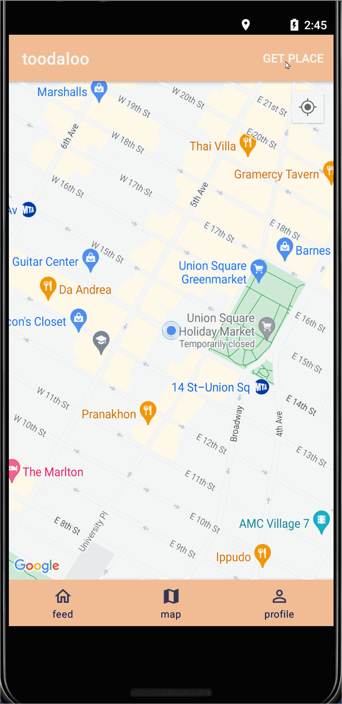

Original App Design Project- Toodaloo
===

# Toodaloo

## Overview
### Description
Application that assists users in locating restrooms within a set radius and other filters. Filters will include the restroom's rating, style of restroom (single room or multiple stalls), Gender neutral and LGBTQ Friendly, and whether the restroom has a Diaper Changing Station. The application will feature other amenities such as Bathroom Codes for the toilet. Users will simply need to press a single button on the screen, which will display a list of bathrooms based on their current location.

### App Evaluation
[Evaluation of your app across the following attributes]
* Category: Location and travel 
* Mobile: Not strictly mobile. Also website. 
* Story: An essential app for travelers/commuters to have access to bathrooms. 
* Market: Anyone can use this app
* Habit: Frequent. Especially for travelers.
* Scope: This app will be challenging to implement but we will look at the lab assignments to help us. 

**Tab Navigation** (Tab to Screen)

* Map
* Profile
* Feed

## Wireframes
[Add picture of your hand sketched wireframes in this section]

### [BONUS] Digital Wireframes & Mockups

### Models
User
|Property|Type|Description|
|--------|----|-----------|
|author|Pointer to User|image author|
|caption|String|profile caption|
|followerCount|Number|number of followers for the user|
|followingCount|Number|number of people user is following|
|image|file|profile image of the user|

Post
|Property|Type|Description|
|--------|----|-----------|
|objectId|objectId|unique id for the user post (default field)|
|author|Pointer to User|image author|
|caption|String|image caption by author|
|commentsCount|Number|number of comments that has been posted to an image|
|likesCount|Number|number of likes for the post|
|ratingBar|image/number|star rating|
|createdAt|DateTime|date when post is created (default field)|
|updatedAt|DateTime|date when post is last updated (default field)|

## Video Walkthrough

Here's a walkthrough of implemented user stories:

