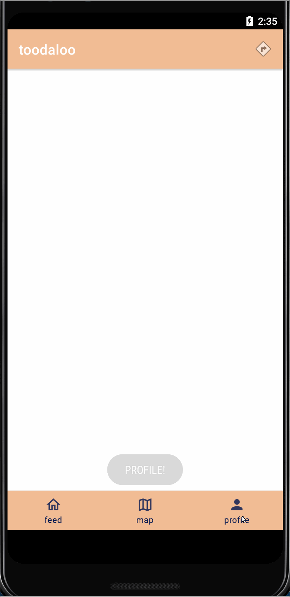

Original App Design Project- Toodaloo
===

# Toodaloo

## Table of Contents
1. [Overview](#Overview)
1. [Product Spec](#Product-Spec)
1. [Wireframes](#Wireframes)
2. [Schema](#Schema)

## Overview
### Description
Application that assists users in locating restrooms within a set radius and other filters. Filters will include User Rating, LGBTQ Friendly, Single restroom (one room one stall), customers only, and radius. Users will simply need to press a single button on the screen (shaped as a poop icon) which brings up directions to the chosen restroom, as well as other icons of other potential bathrooms. 

### App Evaluation
[Evaluation of your app across the following attributes]
* Category: Location and travel 
* Mobile: Not strictly mobile. Also website. 
* Story: An essential app for travelers/commuters to have access to bathrooms. 
* Market: Anyone can use this app
* Habit: Frequent. Especially for travelers.
* Scope: This app will be challenging to implement but we will look at the lab assignments to help us. 

## Product Spec

### 1. User Stories (Required and Optional)

**Unit 13**
The following **required** functionality is completed:

- [X] User can press ** Get Places** in the Action Bar
  - [X] User can click a “Compose” icon in the Action Bar on the top right
  - [X] User can then enter a new review/photo and post this to feed
  - [X] User can swipe to refresh feed
  - [X] User can see only their posts under their Profile


**Required Must-have Stories**

- [x] Login
- [x] Logout
- [x] Maps
- [x] Profile for user 
- [x] Profile for bathroom
- [x] Sign up


**Optional Nice-to-have Stories**

* User can see their profile page with their photos
* People often mentioned tags (in posts for bathroom)
* Helpful or not helpful button for each post.
* Incentive - cute avatar, title
    * Will need a point system bar
* Favorites tab

### 2. Screen Archetypes

* Login
   * User can login
* Sign up page
* Logout
   * User can logout
* Profile for bathroom
    * Reviews about the specific bathroom
    * Address
    * Access Requirements (keys, purchase items, etc.)
    * Diaper station availability 
    * Disabled station availability
    * Details about stalls
    * Write a post button
* Profile for user 
    * Gender 
    * Radius
    * Past posts
* Maps
    * Maps should have an icon for bathrooms
    * Ask user for location access
* Stream
* Favorites Page
    * Shows where you last went/which bathroom did you like to go to. 

### 3. Navigation

**Tab Navigation** (Tab to Screen)

* Map
* Profile
* Feed
* Create


**Flow Navigation** (Screen to Screen)

* Log in Page
    * Log in 
        * Map
        * Profile - On the map, somewhere on the screen (undecided) will have a navigation button for profile. 
    * sign up
        * Sign up page
* Map
    * creation
    * profile
* Creation
    * Profile
    * Stream
* Profile
    * Detail 
    * Stream

## Wireframes
[Add picture of your hand sketched wireframes in this section]


### [BONUS] Digital Wireframes & Mockups

### [BONUS] Interactive Prototype

## Schema


### Models
User
|Property|Type|Description|
|--------|----|-----------|
|author|Pointer to User|image author|
|caption|String|profile caption|
|followerCount|Number|number of followers for the user|
|followingCount|Number|number of people user is following|
|image|file|profile image of the user|

Post
|Property|Type|Description|
|--------|----|-----------|
|objectId|objectId|unique id for the user post (default field)|
|author|Pointer to User|image author|
|caption|String|image caption by author|
|commentsCount|Number|number of comments that has been posted to an image|
|likesCount|Number|number of likes for the post|
|ratingBar|image/number|star rating|
|createdAt|DateTime|date when post is created (default field)|
|updatedAt|DateTime|date when post is last updated (default field)|

### Networking
1. Posting/post feed: 
- (Read/GET) Query all posts where user is author
   ```
   let query = PFQuery(className: "Post")
   query.whereKey("author", equalTo: currentUser)
   query.order(byDescending: "createdAt")
   query.findObjectsInBackground { (posts: [PFObject]?, error: Error?) in
      if let error = error { 
         print(error.localizedDescription)
      } else if let posts = posts {
         print("Successfully retrieved \(posts.count) posts.")
      }
    }
   ```
- (Create/POST) Create a new comment on a post
- (Create/POST) Create a new like on a post
- (Update/PUT) Update the screen with user's post
- (Delete) Delete existing comment
- (Delete) Delete existing like

2. Create Post screen
- (Create/POST) Create a new post object

3. Profile screen
- (Read/GET) Query logged in user object
- (Update/PUT) Update user profile image

4. Create map screen
- (Update/PUT) Update the bathroom map

## Video Walkthrough

Here's a walkthrough of implemented user stories:





GIF created with [LiceCap](http://www.cockos.com/licecap/).

